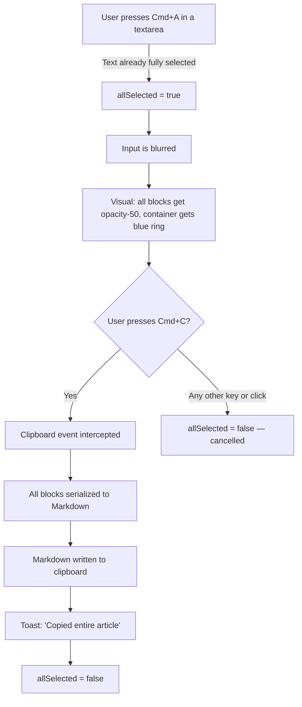
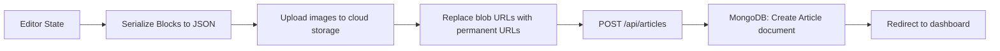

# ZenArticleEditor — Deep Technical Documentation

> **File**: [page.tsx](file:///home/geek/dev/apps/folio/arewa/app/dashboard/articles/new/page.tsx)
> **Route**: `/dashboard/articles/new`
> **Component**: `ZenArticleEditor`
> **Lines**: 799 | **Size**: ~37 KB

---

## Table of Contents

1. [Overview & Design Philosophy](#1-overview--design-philosophy)
2. [Data Model — The Block System](#2-data-model--the-block-system)
3. [UI Layout & Structure](#3-ui-layout--structure)
4. [Block Lifecycle — CRUD Operations](#4-block-lifecycle--crud-operations)
5. [Keyboard Interaction Map](#5-keyboard-interaction-map)
6. [Smart Paste Parser](#6-smart-paste-parser)
7. [Global Select-All & Copy System](#7-global-select-all--copy-system)
8. [Image Handling](#8-image-handling)
9. [Preview Mode](#9-preview-mode)
10. [Settings Sidebar](#10-settings-sidebar)
11. [Publishing Workflow](#11-publishing-workflow)
12. [Current Gaps & Limitations](#12-current-gaps--limitations)
13. [Proposed Backend Integration Architecture](#13-proposed-backend-integration-architecture)
14. [File Map & Cross-References](#14-file-map--cross-references)

---

## 1. Overview & Design Philosophy

The `ZenArticleEditor` is a **custom-built, block-based rich text editor** inspired by the writing experience of Notion and Medium. It is a single-file, self-contained React component that uses **zero external editor libraries** — no TipTap, no Slate, no ProseMirror. Everything is built from scratch using native HTML `<textarea>` and `<input>` elements managed by React state.

### Design Principles

| Principle | Implementation |
|---|---|
| **Zen / Distraction-free** | Full-screen overlay (`fixed inset-0 z-[100]`) with pure white background. No sidebar, no chrome — just content. |
| **Block-based** | Content is an ordered array of typed blocks, not a single rich-text blob. |
| **Typographic** | Uses `font-serif` throughout for an editorial feel. Title is `text-4xl sm:text-5xl`. |
| **No dependencies** | Entire editor is vanilla React + Tailwind — no content-editable, no editor framework. |
| **Fullscreen takeover** | The editor **escapes** the dashboard layout entirely. It renders as a fixed overlay on top of everything. |

---

## 2. Data Model — The Block System

### 2.1 Type Definitions

```typescript
type BlockType = 'p' | 'h2' | 'image' | 'code' | 'url' | 'ul' | 'ol';

interface Block {
  id: string;       // Unique identifier (timestamp-based)
  type: BlockType;  // Determines rendering & behavior
  content: string;  // Raw text content or image URL
}
```

### 2.2 Block Types — Detailed Breakdown

| Type | Element | Placeholder | Behavior |
|---|---|---|---|
| `p` | `<textarea>` | *"Tell your story..."* | Auto-resizing. Enter → new `p` block. Backspace on empty → delete block. |
| `h2` | `<input>` | *"Heading"* | Single-line. Enter → new `p` block below. Backspace on empty → converts to `p` first, then deletes. |
| `ul` | `<textarea>` | *"• List item..."* | Multi-line within single block. Enter → new bullet (`\n• `). Enter on empty bullet → break out to new `p` block. |
| `ol` | `<textarea>` | *"1. List item..."* | Same as `ul` but auto-numbers (`\n2. `, `\n3. `, etc.). |
| `image` | File upload / preview | Upload zone | Shows dashed upload zone or image preview with delete button. No text input. |
| `code` | `<textarea>` | *"// Write or paste your code here..."* | Dark background (`bg-gray-900`), monospace font. No Enter-to-split behavior. |
| `url` | `<input type="url">` | *"Paste a link to embed..."* | Styled with `LinkIcon` prefix. Enter → new `p` block below. |

### 2.3 Initial State

The editor always starts with one empty paragraph block:

```typescript
const [blocks, setBlocks] = useState<Block[]>([
  { id: "init", type: "p", content: "" }
]);
```

### 2.4 State Variables

| State | Type | Purpose |
|---|---|---|
| `title` | `string` | Article title (separate from blocks) |
| `coverImage` | `string \| null` | Object URL of uploaded cover image |
| `blocks` | `Block[]` | Ordered array of content blocks |
| `activeBlockId` | `string \| null` | Block currently hovered (controls floating `+` button visibility) |
| `showMenuId` | `string \| null` | Block whose type-change menu is open |
| `focusBlockId` | `string \| null` | Block to auto-focus on next render cycle |
| `previewMode` | `boolean` | Toggle between edit and preview |
| `showSettings` | `boolean` | Toggle settings sidebar |
| `allSelected` | `boolean` | Whether "select all" mode is active |
| `isSubmitting` | `boolean` | Publish button loading state |

---

## 3. UI Layout & Structure

### 3.1 Full-Screen Overlay

```
┌──────────────────────────────────────────────────────────┐
│ HEADER (h-16, border-b, z-20)                            │
│ [← Back]  Draft / Title    [Save] [Preview] [Publish] [⚙]│
├──────────────────────────────────────────────────────────┤
│                                                          │
│  MAIN (flex-1, overflow-y-auto)     │ SETTINGS SIDEBAR   │
│  ┌─────────────────────────────┐    │ (w-80, absolute,   │
│  │  max-w-3xl mx-auto          │    │  slides in/out)    │
│  │                             │    │                    │
│  │  [Title Input]              │    │ • Category select  │
│  │                             │    │ • URL Slug input   │
│  │  [Block 1: paragraph]       │    │ • Cover Image      │
│  │  [Block 2: heading]         │    │ • SEO Excerpt      │
│  │  [Block 3: image]           │    │                    │
│  │  [Block N: ...]             │    │                    │
│  │                             │    │                    │
│  │  [Clickable empty zone]     │    │                    │
│  └─────────────────────────────┘    │                    │
│                                                          │
└──────────────────────────────────────────────────────────┘
```

### 3.2 Header Actions (Left to Right)

1. **Back Button** — `<Link>` to `/dashboard/articles`, styled as a round icon button.
2. **Draft Label** — Shows "Draft" in uppercase tracking + truncated title (hidden on mobile).
3. **Save Draft** — Button placeholder (hidden on mobile, currently non-functional).
4. **Preview/Edit Toggle** — Switches `previewMode`, icon changes between `Eye` and `Edit2`.
5. **Publish** — Green button, triggers `handleSubmit`.
6. **Settings Gear** — Toggles sidebar (hidden during preview mode).

### 3.3 Block Rendering — Edit Mode

Each block in edit mode is wrapped in a container with:

```
-ml-12 pl-12  (negative margin + padding to create space for floating button)
```

**Floating Action Button (`+`):**
- Appears **only** when the block is hovered AND the block content is empty.
- Positioned absolutely at `left-0 top-1.5`.
- Clicking it opens the block type menu.
- The `+` icon rotates 45° (becomes `×`) when the menu is open.

**Block Type Menu:**
- Absolute positioned dropdown (`left-10 top-0`, `w-56`).
- Contains 7 options: Paragraph, Heading, Bulleted List, Numbered List, Image, Code Block, Embed URL.
- Each option has an icon + label.
- Selecting an option calls `changeBlockType()`.

---

## 4. Block Lifecycle — CRUD Operations

### 4.1 Create — `addBlock(afterId, type)`

```
[Line 47-58]
```

1. Generates a new block ID from `Date.now().toString()`.
2. Finds the index of `afterId` in the blocks array.
3. Splices the new block **after** that index.
4. Closes any open menu.
5. Sets `focusBlockId` to the new block (triggers auto-focus via `useEffect`).

### 4.2 Update — `updateBlock(id, content)`

```
[Line 60-62]
```

Simple immutable map — replaces the content of the matching block.

### 4.3 Transform — `changeBlockType(id, type)`

```
[Line 64-72]
```

1. Changes the block's `type` property.
2. **Resets content** based on new type:
   - `ul` → content becomes `"• "`
   - `ol` → content becomes `"1. "`
   - All others → content becomes `""` (empty string)
3. Closes the menu and re-focuses the block.

> [!WARNING]
> Changing block type **destroys existing content**. There is no confirmation dialog. If a paragraph has text and you change it to a heading, the text is lost.

### 4.4 Delete — `removeBlock(id)`

```
[Line 74-88]
```

1. If it's the **last remaining block**, it doesn't truly delete — it replaces the block with a fresh empty `p` block (the editor always has at least one block).
2. Otherwise, removes the block and focuses the **previous** block.

---

## 5. Keyboard Interaction Map

### 5.1 Block-Level Key Handling — `handleKeyDown(e, block)`

```
[Line 300-357]
```

| Key | Block Type | Condition | Action |
|---|---|---|---|
| `Enter` | `p`, `h2`, `url` | Not Shift+Enter | Creates a new `p` block after the current one |
| `Enter` | `ul` | Current line has content | Inserts `\n• ` at cursor position (stays in same block) |
| `Enter` | `ol` | Current line has content | Inserts `\n{N}. ` at cursor position |
| `Enter` | `ul`/`ol` | Current line is empty bullet (`•` or `N.`) | Removes the empty bullet, breaks out of list, creates new `p` block |
| `Backspace` | Any | Content is empty (or `"• "` / `"1. "`) | If not `p` type → converts to `p`. If already `p` → deletes block. |

> [!NOTE]
> The `code` block has **no** `onKeyDown` handler for Enter — it allows natural newlines within the textarea. Backspace is also not intercepted for code blocks.

### 5.2 Global Key Handling — `handleGlobalKeyDown(e)`

```
[Line 136-148]
```

| Shortcut | Condition | Action |
|---|---|---|
| `Cmd/Ctrl + A` | Active element is a textarea/input AND all its text is already selected | Activates `allSelected` mode, blurs the input, shows toast |

This is a **two-stage select-all**: first `Cmd+A` selects text within the current input, then a second `Cmd+A` triggers global selection of all blocks.

---

## 6. Smart Paste Parser

### Location
```
[Line 153-298] — handlePaste(e, currentBlockId)
```

### Trigger Condition
Only activates when pasted text **contains a newline** (`\n`). Single-line pastes fall through to default browser behavior.

### Parsing Pipeline

The parser processes the pasted text line by line, maintaining internal accumulators:

```
currentParagraph: string[]    — Groups consecutive text lines
currentListItems: string[]    — Groups consecutive list items
currentListType: 'ul'|'ol'|null
currentCodeBlock: string[]|null
```

### Parsing Rules (in priority order)

| Pattern | Detection | Block Type Created |
|---|---|---|
| ` ``` ` | Line starts with triple backtick | Toggles code block accumulator on/off → `code` |
| `# Heading` | `/^#+\s/` | `h2` (all heading levels map to h2) |
| `- item` / `* item` / `• item` | `/^[-*•]\s/` | `ul` (grouped into single block) |
| `1. item` | `/^\d+\.\s/` | `ol` (grouped into single block) |
| `` | Full image markdown regex | `image` |
| Empty line | `trimmed === ''` | Flushes all accumulators |
| Any other text | Default | Grouped into `p` block (consecutive lines joined with `\n`) |

### Insertion Behavior

After parsing, the resulting blocks are inserted into the editor:

- If the **current block is an empty paragraph**, the pasted blocks **replace** it.
- Otherwise, pasted blocks are **inserted after** the current block.
- After insertion, focus jumps to the **last** pasted block.
- A `setTimeout(50ms)` triggers auto-resize on all textareas.

### Flush System

Three flush functions manage the accumulators:

```
flushParagraph() → Commits currentParagraph[] as a single 'p' block
flushList()      → Commits currentListItems[] as a single 'ul'/'ol' block
flushAll()       → Calls both flushParagraph() and flushList()
```

Flushing happens automatically at:
- Blank lines
- Block-type transitions (heading after paragraph, list type change, etc.)
- End of input

---

## 7. Global Select-All & Copy System

### Location
```
[Line 90-148] — useEffect + handleGlobalKeyDown
```

### Workflow



### Markdown Serialization Rules

| Block Type | Markdown Output |
|---|---|
| `p` | Raw content |
| `h2` | `## content` |
| `ul` | Raw content (already has `•` prefixes) |
| `ol` | Raw content (already has `1.` prefixes) |
| `code` | ` ```\ncontent\n``` ` |
| `image` | `` |
| `url` | Raw URL string |

Blocks are joined with `\n\n` (double newline).

### Event Listeners

Three global listeners are registered via `useEffect`:

1. **`copy`** — Intercepts clipboard write when `allSelected` is true.
2. **`click`** — Cancels selection on any click.
3. **`keydown`** — Cancels selection on any key that isn't `Cmd/Ctrl` modifier.

---

## 8. Image Handling

### 8.1 Cover Image

- Managed via `coverImage` state (string URL or null).
- Upload triggered from the **Settings Sidebar** via a hidden `<input type="file" ref={coverInputRef}>`.
- Uses `URL.createObjectURL(file)` — **client-side only, no server upload**.
- Displayed in preview mode as a full-width hero (`h-[40vh] object-cover`).
- Removable via `X` button in both sidebar preview and preview mode.

### 8.2 Block Images

- Created by changing a block's type to `image` via the floating menu.
- Empty image blocks show a **dashed upload zone** (`h-64 sm:h-80`, dashed border).
- After upload, the image preview fills the block with a remove button (`X`) in the top-right.
- Below each image block, a floating `+` button appears on hover to add a new block after it.
- Uses `URL.createObjectURL(file)` — **no server upload**.

> [!CAUTION]
> All images use `URL.createObjectURL()` which creates temporary blob URLs. These URLs are **invalidated when the page is refreshed or the component unmounts**. There is currently no server-side image upload or persistence.

---

## 9. Preview Mode

### Toggle
Controlled by `previewMode` state. Toggle button in the header switches between `Eye` (enter preview) and `Edit2` (back to edit) icons.

### Rendering Differences

| Block Type | Preview Rendering |
|---|---|
| `p` | `<p>` with `text-lg sm:text-xl`, `whitespace-pre-wrap` |
| `h2` | `<h2>` with `text-2xl sm:text-3xl font-bold`, extra top padding |
| `ul` | Each `\n`-separated line rendered as a `<div>` with a bullet `•` prefix |
| `ol` | Each `\n`-separated line rendered with a sequential number prefix |
| `image` | `` with `rounded-2xl`, shadow, border |
| `code` | `<pre>` with `bg-gray-900 text-gray-100`, monospace, `whitespace-pre-wrap` |
| `url` | `<a>` styled as a card with `LinkIcon`, opens in new tab |

### Behavior Changes in Preview Mode
- All `<textarea>` and `<input>` elements are replaced with read-only renderings.
- Empty blocks (except images) are **hidden** (`return null`).
- The Settings gear button is hidden.
- The settings sidebar is forcefully hidden.
- The clickable empty zone at the bottom is hidden.
- The cover image is displayed as a hero at the top of the content area.

---

## 10. Settings Sidebar

### Location
```
[Line 722-794]
```

### Layout
- Absolute positioned panel (`w-full sm:w-80`), slides in from the right.
- Transform-based animation (`translate-x-0` ↔ `translate-x-full`).
- Contains a close `X` button.

### Fields

| Field | Element | Purpose |
|---|---|---|
| **Category** | `<select>` | Dropdown with hardcoded options: Security, Engineering, DeFi, Perspectives |
| **URL Slug** | `<input text>` | Manual slug entry, placeholder: `my-awesome-article` |
| **Cover Image** | Upload zone / preview | Same upload mechanism as described in §8.1 |
| **SEO Excerpt** | `<textarea rows={4}>` | Meta description for search engines and social media |

> [!IMPORTANT]
> None of the sidebar fields are connected to any state or submission logic. The category `<select>` has hardcoded options that don't sync with the categories managed in the Articles Dashboard. The slug and excerpt are uncontrolled inputs with no state binding.

---

## 11. Publishing Workflow

### Current Implementation (Stub)

```typescript
const handleSubmit = (e: React.FormEvent) => {
  e.preventDefault();
  setIsSubmitting(true);
  setTimeout(() => {
    toast.success("Article published successfully");
    router.push("/dashboard/articles");
  }, 1000);
};
```

This is a **mock implementation**. It:
1. Sets loading state.
2. Waits 1 second.
3. Shows a success toast.
4. Redirects to the articles dashboard.

**No data is sent anywhere.** No API call, no database write, no server action.

### Proposed Full Workflow



---

## 12. Current Gaps & Limitations

### Critical Gaps

| Gap | Impact | Severity |
|---|---|---|
| **No persistence** | All content is lost on page refresh | 🔴 Critical |
| **No server-side image upload** | Images use temporary blob URLs | 🔴 Critical |
| **No edit mode** | The "Edit" link on existing articles just opens a blank new editor | 🔴 Critical |
| **No Article model** | No Mongoose model for articles exists in `/models` | 🔴 Critical |
| **No article server actions** | No create/update/delete actions in `/actions` | 🔴 Critical |
| **Sidebar fields uncontrolled** | Category, slug, excerpt have no React state | 🟡 Major |
| **Hardcoded categories** | Sidebar categories don't match dashboard categories | 🟡 Major |

### UX Gaps

| Gap | Description |
|---|---|
| **No drag-and-drop** | Blocks cannot be reordered by dragging |
| **No undo/redo** | No history stack for reverting changes |
| **No inline formatting** | No bold, italic, links within text — plain text only |
| **No auto-save** | No periodic saving to localStorage or server |
| **No keyboard shortcuts for block types** | No `/` command or `Markdown` shortcuts (e.g., typing `## ` to create a heading) |
| **Block type change destroys content** | Switching from paragraph to heading erases the text |
| **Code blocks have no syntax highlighting** | Code is rendered as plain monospace text |
| **No block deletion button** | Can only delete via Backspace on empty — no explicit delete UI |

### Disconnections

- The **Articles Dashboard** (`/dashboard/articles/page.tsx`) uses hardcoded `initialArticles` — not from a database.
- The **public Insights page** (`/insights/page.tsx`) reads from `sampleArticles` in `lib/mock-articles.ts` — a completely separate data source.
- The **Article type** in `lib/mock-articles.ts` has `slug`, `title`, `excerpt`, `content` (single string), `category`, `date`, `readTime`, `imageUrl` — none of which map to the block-based editor model.

---

## 13. Proposed Backend Integration Architecture

### 13.1 Article Mongoose Model

```typescript
// models/Article.ts
interface IArticle {
  title: string;
  slug: string;
  coverImage?: string;
  blocks: Array<{
    id: string;
    type: 'p' | 'h2' | 'image' | 'code' | 'url' | 'ul' | 'ol';
    content: string;
  }>;
  category: string;
  excerpt?: string;
  status: 'draft' | 'published';
  publishedAt?: Date;
  createdAt: Date;
  updatedAt: Date;
}
```

### 13.2 Server Actions Needed

| Action | Purpose |
|---|---|
| `createArticle(data)` | Save new article as draft or publish |
| `updateArticle(id, data)` | Update existing article |
| `deleteArticle(id)` | Remove article |
| `getArticle(slug)` | Fetch single article for editing or viewing |
| `getArticles(filters)` | List articles for dashboard |
| `uploadImage(file)` | Upload image to cloud storage, return permanent URL |

### 13.3 Content Rendering Pipeline

For the public-facing Insights page, blocks need to be rendered to HTML:

```
Block[] → Renderer → <article> HTML
```

The existing `article-content.tsx` component uses simple `content.split('\n\n')` parsing. It would need to be replaced with a block-aware renderer that handles each `BlockType` appropriately — identical to the preview mode rendering already built in the editor.

---

## 14. File Map & Cross-References

| File | Role |
|---|---|
| [new/page.tsx](file:///home/geek/dev/apps/folio/arewa/app/dashboard/articles/new/page.tsx) | **The editor** — 799 lines, single component |
| [articles/page.tsx](file:///home/geek/dev/apps/folio/arewa/app/dashboard/articles/page.tsx) | Articles CMS dashboard — list view with mock data |
| [insights/page.tsx](file:///home/geek/dev/apps/folio/arewa/app/insights/page.tsx) | Public article listing — reads from `mock-articles.ts` |
| [insights/[slug]/page.tsx](file:///home/geek/dev/apps/folio/arewa/app/insights/%5Bslug%5D/page.tsx) | Public article detail — server component wrapper |
| [article-content.tsx](file:///home/geek/dev/apps/folio/arewa/app/insights/%5Bslug%5D/article-content.tsx) | Public article renderer — string-based, not block-aware |
| [mock-articles.ts](file:///home/geek/dev/apps/folio/arewa/lib/mock-articles.ts) | Sample article data + `Article` type definition |
| [dashboard/layout.tsx](file:///home/geek/dev/apps/folio/arewa/app/dashboard/layout.tsx) | Dashboard shell — editor bypasses this via `fixed inset-0` |

---

> **Summary**: The ZenArticleEditor is an impressive custom block editor with solid UX fundamentals (smart paste, list continuation, global copy). Its primary limitation is that it exists entirely in client-side state with no persistence layer. The path to production requires an Article model, server actions for CRUD + image upload, controlled sidebar fields, and a block-aware public renderer to replace the current string-based one.
